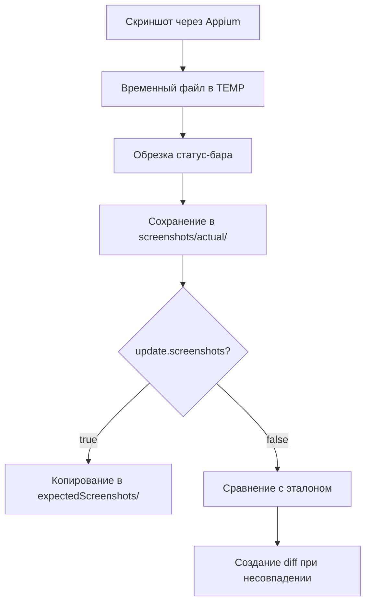

# 📸 Скриншотное тестирование мобильного приложения

## 📋 Содержание

1. [Описание](#описание)
2. [Архитектура](#архитектура)
3. [Структура директорий](#структура-директорий)
4. [Конфигурация](#конфигурация)
5. [Режимы работы](#режимы-работы)
6. [Процесс создания скриншота](#процесс-создания-скриншота)
7. [Написание тестов](#написание-тестов)
8. [Результаты выполнения](#результаты-выполнения)
9. [Allure отчет](#allure-отчет)
10. [CI/CD интеграция](#cicd-интеграция)
11. [Важные моменты](#важные-моменты)
12. [Лучшие практики](#лучшие-практики)
13. [Устранение неполадок](#устранение-неполадок)
14. [Зависимости](#зависимости)
15. [BasePage](#BasePage)
16. [BaseTest](#BaseTest)

## Описание
Фреймворк для автоматизированного скриншотного тестирования верстки мобильного приложения на Android. Позволяет сравнивать актуальные скриншоты экранов с эталонными и выявлять различия в UI.

## Архитектура

```
┌─────────────────┐     ┌─────────────────┐     ┌─────────────────┐
│  ScreenshotTests │────▶│     BaseTest    │────▶│    BasePage     │
└─────────────────┘     └─────────────────┘     └─────────────────┘
         │                       │                       │
         ▼                       ▼                       ▼
┌─────────────────┐     ┌─────────────────┐     ┌─────────────────┐
│   MainPage      │     │   GamePage      │     │   Constants     │
└─────────────────┘     └─────────────────┘     └─────────────────┘
```

## Структура директорий
```
project-root/
├── src/
│   ├── test/
│   │   ├── java/
│   │   │   └── ru/kuz/alchemy/
│   │   │       ├── tests/
│   │   │       │   ├── BaseTest.java
│   │   │       │   └── ScreenshotTests.java
│   │   │       ├── pages/
│   │   │       │   ├── BasePage.java
│   │   │       │   ├── MainPage.java
│   │   │       │   └── GamePage.java
│   │   │       └── helper/
│   │   │           └── Constants.java
│   │   └── resources/
│   │       ├── expectedScreenshots/     # Эталонные скриншоты
│   │       └── test.properties           # Конфигурация
├── screenshots/
│   └── actual/                           # Актуальные скриншоты
├── build/
│   └── diff/                             # Скриншоты с различиями
└── README.md
```

## Конфигурация

### test.properties
```properties
# Режим обновления эталонов (true - создание/обновление, false - сравнение)
update.screenshots=false

# Остальные настройки приложения...
```

### Constants.java
```java
public class Constants {
    // Папка для актуальных скриншотов
    public static final String SCREENSHOT_TO_SAVE_FOLDER = "screenshots/actual/";
    
    // Папка для эталонных скриншотов
    public static final String EXPECTED_SCREENSHOT_TO_SAVE_FOLDER = 
        "src/test/resources/expectedScreenshots/";
}
```

## Режимы работы
### 1. Режим обновления эталонов (`update.screenshots=true`)

**Используется:**
- При первом запуске тестов
- После изменений в верстке
- Для создания новых эталонов

**Что происходит:**
1. Тест делает скриншот экрана
2. Автоматически обрезается статус-бар
3. Скриншот сохраняется как эталон в `expectedScreenshots/`
4. Тест завершается без сравнения

### 2. Режим сравнения (`update.screenshots=false`)

**Используется:**
- В CI/CD пайплайнах
- При регулярном прогоне тестов
- Для проверки регрессий

**Что происходит:**
1. Тест делает актуальный скриншот
2. Сравнивается с эталоном из `expectedScreenshots/`
3. При различиях создается diff-изображение в `build/diff/`
4. Результат прикрепляется к Allure-отчету

## Процесс создания скриншота



## Написание тестов
### Пример тестового класса
```java
public class ScreenshotTests extends BaseTest {
    
    @Test
    @Description("Позитивный тест: Проверка скриншота страницы Play")
    public void testGameScreenshot() {
        mainPage.waitForPageLoaded()
                .tapPlay();
        
        File screenshot = gamePage.waitForScreenLoaded()
                                  .fullPageScreenshot();
        
        assertScreenshot(screenshot, testInfo.getDisplayName());
    }
    
    @Test
    @Description("Негативный тест: Проверка скриншота страницы Play")
    public void testGameScreenshotFail() {
        mainPage.waitForPageLoaded()
                .tapPlay();
        
        File screenshot = gamePage.waitForScreenLoaded()
                                  .fullPageScreenshot();
        
        // Принудительно указываем имя файла для негативного теста
        assertScreenshot(screenshot, "testGameScreenshotFail()");
    }
}
```

### Создание страничных объектов
```java
public class GamePage extends BasePage {
    
    @Step("Ожидаем загрузки игрового экрана")
    public GamePage waitForScreenLoaded() {
        // Логика ожидания загрузки
        return this;
    }
    
    // Другие методы страницы
}
```

## Результаты выполнения

### Успешное выполнение
```
✅ Скриншоты совпадают
```

### Неуспешное выполнение
```
❌ Найдены различия в скриншотах!
   Ожидаемый: D:/project/src/test/resources/expectedScreenshots/testGameScreenshot.png
   Актуальный: D:/project/screenshots/actual/screenshot_123456789.png
   Diff: D:/project/build/diff/diff_testGameScreenshot.png
```

## Allure отчет

В Allure-отчете доступны:
- ✓ Шаги выполнения теста
- ✓ Скриншоты эталонов
- ✓ Актуальные скриншоты
- ✓ Diff-изображения при ошибках

## CI/CD интеграция

```yaml
# Пример для Jenkins/GitLab CI
stages:
  - test

screenshot-tests:
  stage: test
  script:
    # Первый проход - создание эталонов
    - export UPDATE_SCREENSHOTS=true
    - ./gradlew test --tests *ScreenshotTests
    
    # Второй проход - проверка
    - export UPDATE_SCREENSHOTS=false
    - ./gradlew test --tests *ScreenshotTests
    
    # Сохранение отчетов
    - allure generate build/allure-results
  artifacts:
    paths:
      - screenshots/actual/
      - build/diff/
      - build/reports/
```

## Важные моменты

### Обрезка статус-бара
- Метод `getStatusBarHeight()` пытается получить реальную высоту через ADB
- При неудаче используется значение по умолчанию (150px)
- Обрезка происходит **до** сохранения в целевую папку

### Именование файлов
- Актуальные: `screenshot_время.png`
- Эталонные: `testGameScreenshot.png` (по имени теста)
- Diff: `diff_testGameScreenshot.png`

### Обработка ошибок
- Проверка существования папок перед сохранением
- Graceful degradation при ошибках обрезки
- Подробное логирование всех операций

## Лучшие практики

1. **Первый запуск** всегда с `update.screenshots=true`
2. **Эталонные скриншоты** хранить в Git
3. **Обновлять эталоны** только при осознанных изменениях UI
4. **Использовать описательные имена** тестов для понятных имен файлов
5. **Регулярно чистить** папку `build/diff/`

## Устранение неполадок

| Проблема | Решение |
|----------|---------|
| `SIZE_MISMATCH` | Проверить высоту статус-бара в `getStatusBarHeight()` |
| `Image not found` | Проверить пути в `Constants` |
| Не создаются папки | Проверить права на запись |
| Скриншоты во временной папке | Проверить метод `fullPageScreenshot()` |

## Зависимости

- Selenide
- Appium Java Client
- Allure
- ImageComparison (romankh3)

## BasePage

```java
/**
 * Базовый тестовый класс для скриншотов
 */
public class BasePage {

    private static final Logger log = LoggerFactory.getLogger(BasePage.class);
    private SelenideElement content = $(AppiumBy.id("android:id/content"));
    /**
     * Делает скриншот экрана без статусбара
     *
     * @return файл скриншота
     */
    public File fullPageScreenshot() {
        log.info("Начинаю делать скриншот");
        try {
            // Получаем driver
            AndroidDriver driver = (AndroidDriver) WebDriverRunner.getWebDriver();
            // Делаем скриншот через Appium
            File fullScreenshot = driver.getScreenshotAs(OutputType.FILE);
            // Сразу сохраняем в нужную папку
            String fileName = "screenshot_" + System.currentTimeMillis() + ".png";
            File targetFile = new File(Constants.SCREENSHOT_TO_SAVE_FOLDER, fileName);
            // Создаем папки если надо
            boolean mkdirs = targetFile.getParentFile().mkdirs();

            // Копируем во временный файл для обрезки
            File tempFile = new File(System.getProperty("java.io.tmpdir"), "temp_" + fileName);
            Files.copy(fullScreenshot.toPath(), tempFile.toPath(), StandardCopyOption.REPLACE_EXISTING);

            // Обрезаем и сразу сохраняем в целевую папку
            File croppedScreenshot = cropStatusBar(tempFile, targetFile);

            if (croppedScreenshot != null && croppedScreenshot.exists()) {
                log.info("Скриншот сохранен: {}", croppedScreenshot.getAbsolutePath());
                return croppedScreenshot;
            }

            // Если обрезка не удалась, сохраняем полный
            Files.copy(fullScreenshot.toPath(), targetFile.toPath(), StandardCopyOption.REPLACE_EXISTING);
            return targetFile;

        } catch (Exception e) {
            log.error("Ошибка при создании скриншота через Appium", e);
            return Screenshots.takeScreenShot(content);
        }
    }

    /**
     * Обрезает статус-бар сверху
     */
    private File cropStatusBar(File sourceFile, File targetFile) {
        try {
            BufferedImage originalImage = ImageIO.read(sourceFile);
            // Высота статус-бара (обычно на эмуляторах 100-150px)
            // Можно получить программно через driver.manage().window().getSize()
            int statusBarHeight = getStatusBarHeight();

            if (statusBarHeight <= 0 || statusBarHeight >= originalImage.getHeight()) {
                return null;
            }

            // Обрезаем: оставляем только то, что ниже статус-бара
            BufferedImage croppedImage = originalImage.getSubimage(
                    0,                          // x
                    statusBarHeight,             // y (начинаем со статус-бара)
                    originalImage.getWidth(),    // width
                    originalImage.getHeight() - statusBarHeight  // height
            );

            ImageIO.write(croppedImage, "png", targetFile);
            return targetFile;
        } catch (IOException e) {
            log.error("Ошибка при обрезке скриншота", e);
            return null;
        }
    }

    /**
     * Получает высоту статус-бара
     */
    private int getStatusBarHeight() {
        try {
            AndroidDriver driver = (AndroidDriver) WebDriverRunner.getWebDriver();

//            // Способ 1: через driver получаем всю высоту экрана
//            int screenHeight = driver.manage().window().getSize().getHeight();
//            log.info("высота статус-бара {}", screenHeight);
            // Способ 2: через adb (более точно)
            String result = driver.executeScript("mobile: shell",
                    Map.of("command", "dumpsys window displays")).toString();
            int barHeight = Integer.parseInt(result);
            // Парсим результат или используем константу для твоего эмулятора
            return barHeight; // Например, для Pixel 5 эмулятора

        } catch (Exception e) {
            log.warn("Не удалось получить высоту статус-бара, используем 150px");
            return 150;
        }

    }

}
```

---
## BaseTest

```java
/**
 * Базовый тестовый класс
 */
@ExtendWith(AllureListener.class)
public class BaseTest {
    private static final Logger log = LoggerFactory.getLogger(BaseTest.class);

    /**
     * Проверка скриншота с эталоном для проверки верстки
     * @param actualScreenshot актуальный скриншот
     * @param expectedFileName название файла для сравнений
     */
    public void assertScreenshot(File actualScreenshot, String expectedFileName) {
        //в метод передается всегда название тестового метода, поэтому меняем скобки на файл с расширением для дальнейшего сохранения
        expectedFileName = expectedFileName.replace("()", ".png");

        //если скриншоты надо обновить updateScreenshots = true
        if (ConfigReader.testConfig.isScreenshotsNeedToUpdate()) {
            try {
                // Создаем папку если её нет
                Files.createDirectories(new File(Constants.EXPECTED_SCREENSHOT_TO_SAVE_FOLDER).toPath());

                // РЕЖИМ ОБНОВЛЕНИЯ: копирует текущий скриншот как эталон
                Files.move(actualScreenshot.toPath(),
                        new File(Constants.EXPECTED_SCREENSHOT_TO_SAVE_FOLDER + expectedFileName).toPath(),
                        StandardCopyOption.REPLACE_EXISTING);
                log.info("✅ Скриншот сохранен как эталон: " + expectedFileName);
            } catch (IOException e) {
                throw new RuntimeException("Не удалось сохранить эталонный скриншот", e);
            }
            return;
        }

        // РЕЖИМ СРАВНЕНИЯ: ищет эталон и сравнивает
        try {
            // Загружаем ожидаемое изображение из resources
            File expectedFile = new File(Constants.EXPECTED_SCREENSHOT_TO_SAVE_FOLDER + expectedFileName);
            if (!expectedFile.exists()) {
                throw new RuntimeException("Эталонный скриншот не найден: " + expectedFile.getAbsolutePath() +
                        "\nЗапусти тест с update.screenshots=true для создания эталона");
            }

            BufferedImage expectedImage = ImageComparisonUtil
                    .readImageFromResources(Constants.EXPECTED_SCREENSHOT_TO_SAVE_FOLDER + expectedFileName);

            // Загружаем актуальный скриншот (из файловой системы, а не из resources!)
            BufferedImage actualImage = ImageIO.read(actualScreenshot);
            if (actualImage == null) {
                throw new RuntimeException("Не удалось прочитать актуальный скриншот: " + actualScreenshot.getAbsolutePath());
            }

            // Где будем хранить скриншот с различиями
            File diffDir = new File("build/diff");
            diffDir.mkdirs();
            File resultDestination = new File(diffDir, "diff_" + expectedFileName);

            // Сравниваем
            ImageComparison imageComparison = new ImageComparison(expectedImage, actualImage, resultDestination);
            ImageComparisonResult imageComparisonResult = imageComparison.compareImages();

            // Если скриншоты отличаются
            if (imageComparisonResult.getImageComparisonState() == ImageComparisonState.MISMATCH) {
                // Добавляем скриншот с отличиями в Allure
                if (resultDestination.exists()) {
                    byte[] diffImageBytes = Files.readAllBytes(resultDestination.toPath());
                    AllureListener.saveScreenshot(diffImageBytes);
                }

                // Логируем информацию о различиях
                log.info("❌ Найдены различия в скриншотах!");
                log.info("   Ожидаемый: " + expectedFile.getAbsolutePath());
                log.info("   Актуальный: " + actualScreenshot.getAbsolutePath());
                log.info("   Diff: " + resultDestination.getAbsolutePath());
            } else {
                log.info("✅ Скриншоты совпадают");
            }

            // Сравниваем
            assertEquals(ImageComparisonState.MATCH, imageComparisonResult.getImageComparisonState());

        } catch (IOException e) {
            throw new RuntimeException("Ошибка при сравнении скриншотов", e);
        }
    }

}

```